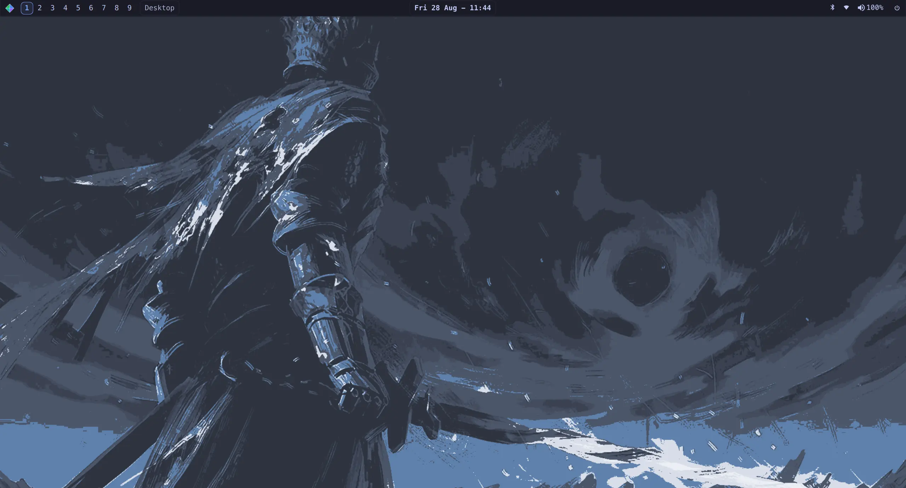

<div align="center">
  <picture>
    <source media="(prefers-color-scheme: dark)" srcset="./assets/logo/lyona-logo-horizontal-dark.png" />
    
  </picture>
  <p><strong>An Arch Linux X11 desktop built for keyboard-driven work</strong></p>
  <p>
    <a href="https://dwm.technicks89.com">Documentation</a> |
    <a href="https://github.com/technicks89/Lyona/releases/latest">Latest release</a> |
    <a href="./CHANGELOG.md">Changelog</a> |
    <a href="./CONTRIBUTING.md">Contributing</a>
  </p>
</div>



This is a fork of [dwm-titus](https://github.com/ChrisTitusTech/dwm-titus). It is designed to run on Arch Linux rather than Fedora. 
lyona also draws inspiration from [Omarchy](https://github.com/basecamp/omarchy).

lyona is a complete, lightweight X11 desktop with sensible defaults,
guided installation, and powerful customization. It is designed for people who
want a responsive keyboard-first workflow without having to assemble every
part themselves.

**lyona is an Arch Linux-only distribution.** Arch Linux is the sole
supported platform for installation, runtime behavior, package resolution,
testing, and release qualification. Use either the Arch installer image or
the existing-system installer on Arch Linux.

## What You Get

| Experience | What it includes |
| --- | --- |
| **A focused desktop** | Automatic window tiling, nine workspaces, fast keyboard navigation, multi-monitor support, and flexible fullscreen modes. |
| **Everyday essentials** | A polished panel, application launcher, system tray, Control Center, Settings, notifications, screenshots, audio, brightness, and power controls. |
| **Easy discovery** | An interactive keybind viewer, guided display setup, built-in diagnostics, and clear unsupported-feature reporting. |
| **Personal configuration** | Live-reloading hotkeys, themes, and window rules, with local configuration preserved across upgrades. |
| **Two installation paths** | A ready-to-install Arch image or an installer for an existing Arch system. |

> lyona is an X11 desktop. A Wayland-native session is not currently part
> of the project scope.

## Install

Choose the path that matches your system:

| Installation | Best for | What it does |
| --- | --- | --- |
| [Arch ISO](#arch-iso) | A fresh, dedicated installation | Boots a live Arch image with this checkout preloaded for a guided install. |
| [Existing system](#existing-system) | An Arch installation you already use | Installs dependencies, the desktop session, and the selected feature set while preserving local configuration. |

For complete requirements and installation details, see the
[Installation Guide](https://dwm.technicks89.com/install.html).

### Arch ISO

Build the installer image from this checkout (requires the `archiso`
package, on an Arch host):

```bash
sudo scripts/build-lyona-arch-iso.sh
```

The image is named for the release it was built from, so the current
checkout produces `out/lyona-2026.08.0-x86_64.iso`. A booted medium
reports its exact build in `/etc/lyona-iso-release`.

Write the resulting ISO to a USB drive and boot it (UEFI only). The
`lyona-install` wizard launches automatically — arrow-key menus for
disk/keyboard, a few prompts for user/hostname/timezone, no
desktop-environment picker — then drives `archinstall` unattended and
automatically finishes installing lyona. ISO installs get the `multilib`
and [CachyOS](https://cachyos.org) repositories and both the `linux-cachyos`
and `linux-cachyos-lts` kernels without being asked; the stock Arch kernel
stays the default boot entry, so the CachyOS ones are there to select, not
to surprise you. See the
[Installation Guide](https://dwm.technicks89.com/install.html) for details.
No prebuilt ISO is currently published as a release; build one yourself
with the script above.

### Existing System

```bash
git clone https://github.com/technicks89/Lyona.git
cd Lyona

./install.sh --dry-run --non-interactive --profile recommended
./install.sh --profile recommended
```

The dry run shows the dependency and installation plan before anything changes.
The installer requires Arch Linux, preserves existing personal configuration,
and installs the managed desktop components. It accepts only Arch's
`/etc/os-release` identity and rejects every other operating-system identity
before making changes.

| Profile | Includes |
| --- | --- |
| `core` | The X11 session, required dependencies, and one terminal emulator. |
| `recommended` | The complete everyday desktop, including Alacritty, Quickshell, Gear Lever for AppImages, theming, screenshots, audio, and brightness tools. |
| `full` | The recommended desktop plus optional file-manager, keyring, wallpaper, display-manager, and supported Arch gaming integrations (Steam, Gamescope, GameMode, MangoHud via `multilib`). |

On x86_64, `--enable-cachyos-repos` adds the [CachyOS](https://cachyos.org)
repositories for this CPU's ISA level, and `--cachyos-kernel` also installs
`linux-cachyos` and adds a boot entry for it. Both are opt-in, ask before
touching `pacman.conf`, and back it up first; see the
[Installation Guide](https://dwm.technicks89.com/install.html) for what they
change.

`maim` is an optional dependency used only by the screenshot hotkeys. If it is
unavailable, installation continues and reports that the screenshot hotkeys
remain disabled; invoking one makes `dwm-screenshot` exit with
`dwm-screenshot: maim is not installed`. `xclip` and `xdotool` remain required
runtime dependencies for the X11 desktop and its other managed helpers.

## First Login

**Super** is the Windows key on most keyboards.

| Action | Keybind |
| --- | --- |
| Open the application launcher | <kbd>Super</kbd> + <kbd>R</kbd> |
| Open Alacritty terminal | <kbd>Super</kbd> + <kbd>X</kbd> |
| Open Control Center | <kbd>Super</kbd> + <kbd>F1</kbd> |
| Show the interactive keybind viewer | <kbd>Super</kbd> + <kbd>/</kbd> |
| Close the focused window | <kbd>Super</kbd> + <kbd>Q</kbd> |
| Switch workspace | <kbd>Super</kbd> + <kbd>1-9</kbd> |
| Open the power menu | <kbd>Super</kbd> + <kbd>Ctrl</kbd> + <kbd>Q</kbd> |

With a display manager, select the `dwm` session when logging in. From a TTY,
start the session with:

```bash
startx
```

## Customize Your Desktop

Most personal settings live under:

```text
${XDG_CONFIG_HOME:-$HOME/.config}/lyona/
```

Hotkeys, themes, and window rules reload when their TOML files are saved.
Advanced compile-time preferences live in the user-owned `config.h`, which the
installer and future upgrades preserve.

The installer also provides `dwm-settings-display` and its root-owned
`libexec/lyona/dwm-settings-display-root` persistence helper. Live display
discovery and previews require `xrandr`; hotplug watching requires `udevadm`;
only persistent Xorg install and rollback require `pkexec`. Named profiles live
under the `display-profiles/` directory in the XDG path above.
Run `dwm-display-setup detect`, then `dwm-display-setup`, for a guided wizard
that detects outputs and configures modes, positions, rotation, and the primary
display with a reversible preview. Persistent generation selects compatible
TearFree or NVIDIA Full Composition Pipeline behavior automatically; pass
`--force-full-composition-pipeline off` to disable the NVIDIA default.
The adjacent `dwm-settings-input` provider uses `xinput`, `setxkbmap` for
keyboard settings, and `udevadm` for stable device identity and hotplug events.
Kept values are stored in `input-settings.conf` in the same XDG directory;
`DWM_INPUT_SETTINGS_FILE` can select another file.

See the [Configuration Guide](https://dwm.technicks89.com/configuration.html)
and [Theming Guide](https://dwm.technicks89.com/theming.html) for examples and
safe customization paths.

## Documentation

- [Installation](https://dwm.technicks89.com/install.html)
- [Getting Started](https://dwm.technicks89.com/getting-started.html)
- [Keybindings](https://dwm.technicks89.com/keybinds.html)
- [Configuration](https://dwm.technicks89.com/configuration.html)
- [Theming](https://dwm.technicks89.com/theming.html)
- [Control Center](https://dwm.technicks89.com/control-center.html)
- [Settings](https://dwm.technicks89.com/settings.html)
- [How lyona Works](https://dwm.technicks89.com/patches.html)
- [Troubleshooting](https://dwm.technicks89.com/troubleshooting.html)

The technical guide explains the project architecture, what dwm is, and how
the maintained enhancements fit together. You do not need to understand or
apply dwm patches to install and use the desktop.

## Troubleshooting

Start with the built-in diagnostic report:

```bash
dwm-diagnostics
```

You can also open **Control Center -> System Health** for a graphical overview.
If the session does not start, run `startx` from a TTY to see its error output.
The [Troubleshooting Guide](https://dwm.technicks89.com/troubleshooting.html)
covers common session, panel, terminal, theme, display, and NVIDIA issues.

If the problem remains, [open an issue](https://github.com/technicks89/Lyona/issues)
and include the relevant diagnostic output. Review it first and remove any
private system information.

## Contributing

Contributions are welcome. Read [CONTRIBUTING.md](CONTRIBUTING.md) for the
development workflow and validation requirements, and report security issues
using [SECURITY.md](SECURITY.md).

The main repository check uses a managed workspace under `$HOME/tmp` and
removes it when the run finishes:

```bash
scripts/run-tests
```

Project requirements and active work are tracked in [SPEC.md](SPEC.md),
[ROADMAP.md](ROADMAP.md), and [TASKS.md](TASKS.md).
